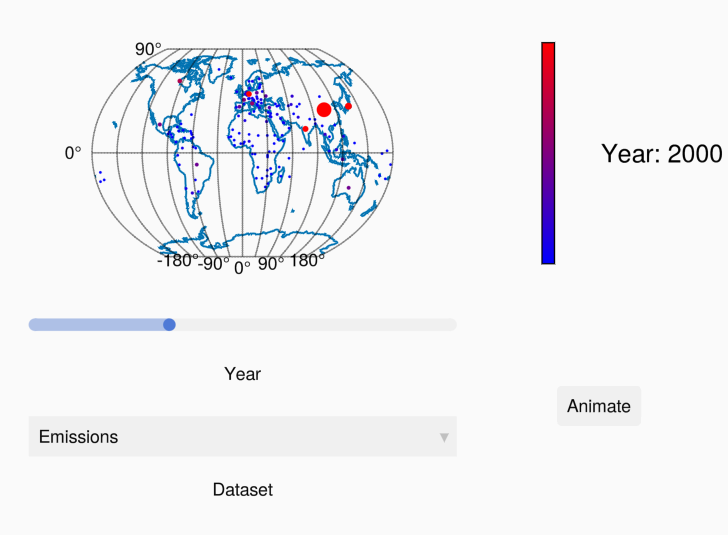

# Global Carbon Emissions and Deforestation Visualization

This project visualizes global carbon emissions and deforestation trends over 25 years using Julia, WGLMakie, and Bonito. The data is plotted on a globe, with animations based on observable data. An interactive web-based user interface (UI) allows for exploration of the trends and data. Different intensities are represented with varying marker sizes and colors, making it easier to visualize and differentiate between regions with high and low emissions or deforestation.

### Key Features:
- **Data Visualization**: Global carbon emissions and deforestation data displayed on a globe, spanning 25 years.
- **Animation**: Data trends are animated over time using observables, creating dynamic visualizations.
- **Interactive UI**: Users can explore the data interactively through a web-based interface built with Julia.
- **Markings for Intensity**: Different color and size markings are used to represent varying levels of carbon emissions and deforestation intensity. Higher intensities are indicated with larger, more vivid markers, while lower intensities use smaller, subtler markings.

### Screenshot of UI:

Below is an example of the interactive UI showing the global visualization:



### Data Sources:
The original dataset only contained country names and corresponding emissions and deforestation data. The coordinates for each country were retrieved using a separate dataset containing country names and their respective coordinates.

### Technologies Used:
- **WGLMakie**: A visualization library in Julia for interactive 3D plotting.\
- **Julia**: The programming language used for the entire implementation, including data processing, visualization, and UI.

### Installation:
To get started, clone this repository and ensure that you have the required Julia packages installed:
```bash
git clone https://github.com/your-username/global-carbon-deforestation-visualization.git
cd global-carbon-deforestation-visualization
